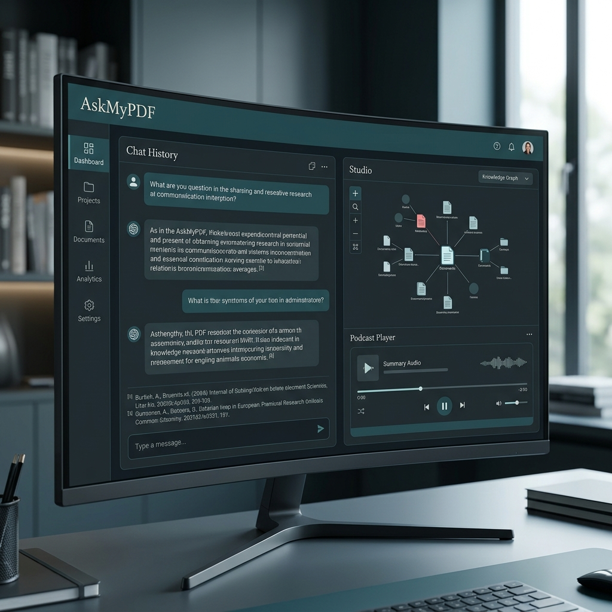

# AskMyPDF — Scholarly Research & Document Intelligence 🖋️



AskMyPDF is a premium, production-grade Retrieval-Augmented Generation (RAG) platform designed for researchers, students, and professionals. It transforms static PDF repositories into a dynamic, conversational workspace with a focus on **Scholarly Precision** and high-trust citations.

Inspired by the clean, sophisticated aesthetic of Google NotebookLM, AskMyPDF combines state-of-the-art LLM reasoning with a powerful "Studio" suite for content synthesis.

## ✨ Key Features

### 🏛️ Scholarly Precision UI
- **Dual-Pane Workspace**: Seamlessly switch between conversational analysis and structured document views.
- **Deep Citations**: Every claim is backed by a "Source Card" linking directly to the specific page and passage in your original documents.
- **Serif-First Design**: A professional, high-trust visual language tailored for deep focus and academic research.

### 🎙️ The Studio Module
Beyond chat, the Studio allows you to synthesize knowledge into various formats:
- **Audio Overview**: Generate a two-host podcast-style conversation discussing your documents (powered by ElevenLabs or Browser TTS).
- **Interactive Mindmaps**: Visualize complex relationships between concepts across your entire corpus.
- **Auto-Generated Presentations**: Instantly create professional `.pptx` slide decks from your research.
- **Briefing Docs & Data Tables**: Extract structured insights and summaries with high fidelity.

### 🧠 Advanced RAG Engine
- **Multi-Stage Retrieval**: Combines semantic search with cross-encoder reranking for maximum relevance.
- **Context-Aware Memory**: Remembers your line of questioning to provide coherent, multi-turn answers.
- **Hybrid Backend**: Support for **Google Gemini 1.5 Pro** for massive context windows, or **Ollama** (Mistral/Llama3) for full local privacy.

---

## 🚀 Quick Start

### 1. Installation
Clone the repository and install dependencies:
```bash
pip install -r requirements.txt
```

### 2. Environment Setup
Create a `.env` file from the example:
```bash
cp .env.example .env
```
Fill in your API keys (Google Gemini, ElevenLabs, etc.) in the `.env` file.

### 3. Launch the Application
```bash
streamlit run app/main.py
```

---

## 🛠️ Tech Stack
- **Frontend**: Streamlit with Custom CSS (Scholarly Precision System)
- **RAG Engine**: LangChain / Custom Semantic Chunking
- **Vector Store**: FAISS
- **Models**: Gemini 1.5 Pro, GPT-4o, or Local Ollama
- **Audio**: ElevenLabs API / Browser SpeechSynthesis
- **Mindmaps**: D3.js Integration

---

## 📦 Docker Support
Run the entire stack with Docker Compose:
```bash
docker-compose up --build
```

---

## 📜 License
MIT License. Created by [Ayanmohd18](https://github.com/Ayanmohd18).
